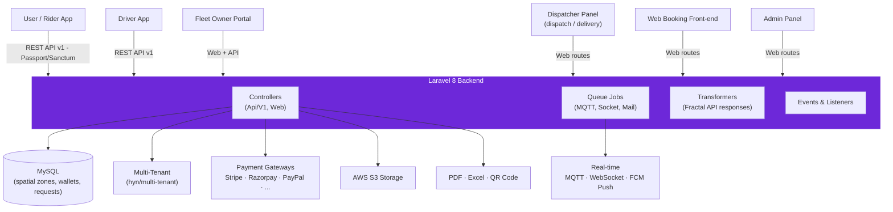

<p align="center">
  
</p>

<p align="center">
  
  
  
  
  
</p>

> **Developed by [Arslan Malik](https://github.com/arsalanmaalik461)**
> 📱 WhatsApp: [+92 300 8987448](https://wa.me/923008987448) · 🌐 Website: [arslanmalik.tech](https://arslanmalik.tech)

---

## 🌟 Executive Overview

**Arsu** is a full-featured ride-hailing and on-demand delivery platform backend, built on Laravel 8. It powers the complete lifecycle of a transport business: riders and shippers create trip or delivery requests through mobile APIs or web booking, drivers receive real-time job assignments, dispatchers manage fleets from a live control panel, and every payment flows through a wallet-aware multi-gateway billing engine.

The system is built for scale from day one. A multi-tenant architecture (`hyn/multi-tenant`) lets companies and fleet owners operate isolated tenants under one deployment. Dynamic pricing combines geo-fenced zones, per-vehicle-type price matrices, surge pricing, and promo codes, while real-time dispatch runs over MQTT/WebSocket jobs with automatic driver fallback ("no driver found" recovery) and push notifications via FCM.

Everything is rounded out with the operational tooling a real business needs: PDF invoicing, Excel exports, QR-code generation, SOS safety, complaints and ratings, in-app chat, document-verified driver onboarding, and mobile-app build management — all behind a role-based admin, dispatcher, and fleet-owner web interface.

---

## 📑 Table of Contents

- [✨ Key Features & Highlights](#-key-features--highlights)
- [🖥️ Feature Showcase](#️-feature-showcase)
- [🏗️ System Architecture](#️-system-architecture)
- [🚀 Quickstart & Installation Guide](#-quickstart--installation-guide)
- [📂 Project Structure](#-project-structure)
- [🛡️ Security & Notes](#️-security--notes)

---

## ✨ Key Features & Highlights

| Feature | Description |
| :--- | :--- |
| Ride & Delivery Booking | Adhoc ETA, create-request, package listing, and goods-type APIs for taxi and delivery (`transport_type` = taxi/delivery), plus web-booking pages and ride-later scheduling |
| Multi-Tenant Architecture | `hyn/multi-tenant` powers isolated company/owner tenants on a single deployment |
| Driver Lifecycle | Onboarding with required-document verification, car makes/models, driver details, and per-driver wallets |
| Dynamic Pricing | Geo-fenced zones with spatial bounds, zone-type price matrices, surge pricing, rental packages, and promo codes |
| Multi-Gateway Payments | Stripe, Razorpay, PayPal, Cashfree, CCAvenue, MercadoPago, Paystack, Flutterwave, Khalti, and Sadad integrations |
| Wallet Engine | Separate user and driver wallets with full transaction history |
| Real-Time Dispatch | MQTT and WebSocket job broadcasting, auto-assignment to next driver, dispatcher panels for taxi and delivery |
| Safety & Support | SOS alerts, complaint titles and tickets, cancellation reasons, two-way trip ratings, and in-app chat |
| Invoicing & Reporting | PDF invoices, Excel exports, QR codes, and booking-confirmation documents |
| Mobile-Ready API v1 | OAuth-secured (Passport + Sanctum) REST endpoints for user, driver, owner, dispatcher, and payment clients |

---

## 🖥️ Feature Showcase

### 1. Ride & Delivery Booking Engine

> "One request pipeline for taxis, deliveries, and scheduled rides — from ETA to bill."

- Adhoc booking APIs: `adhoc-eta`, `adhoc-create-request`, `adhoc-list-packages`, goods types — documented in `webbooking-apis.txt`
- Web booking front-end (`web-booking` views) with live trip tracking pages (`track-request`)
- Rental packages and ride-later scheduling stored on each request
- Request billing records every fare component for transparent invoicing

### 2. Real-Time Dispatch & Fleet Management

> "Dispatchers see the whole city; drivers never wait on a stale job."

- Dedicated dispatch panels: `dispatch`, `dispatch-new`, and `dispatch-delivery`
- Job pipeline: `NotifyViaSocket`, `NotifyViaMqtt`, `SendRequestToNextDriversJob` — automatic fallback to the next nearest driver
- `NoDriverFoundNotifyJob` recovery flow when no driver accepts
- Fleet owners get their own dashboard with companies, zones, and vehicle-type management

### 3. Payments, Wallets & Multi-Gateway Billing

> "Ten payment gateways, one wallet ledger — riders pay, drivers earn, owners settle."

- Gateway views for Stripe, Razorpay, PayPal, Cashfree, CCAvenue, MercadoPago, Paystack, Flutterwave, Khalti, and Sadad
- User and driver wallets with complete history tables (`user_wallet_history`, `driver_wallet_history`)
- Card info vault, promo application, and request-bill breakdowns
- PDF invoices and Excel reports for accounting

---

## 🏗️ System Architecture



---

## 🚀 Quickstart & Installation Guide

### Prerequisites

- PHP ^7.3 or ^8.2 with Composer
- MySQL (spatial extensions for zone geofencing)
- Node.js + npm (Laravel Mix asset build)
- Redis or database queue driver for background jobs

### Step-by-Step Installation

```bash
# 1. Clone the repository
git clone https://github.com/arsalanmaalik461/arsu.git
cd arsu

# 2. Install PHP dependencies
composer install

# 3. Configure environment
cp .env.example .env
php artisan key:generate

# 4. Set database credentials in .env (MySQL), then migrate
php artisan migrate --seed

# 5. Install and build front-end assets
npm install
npm run dev        # or: npm run prod for production

# 6. Start the development server
php artisan serve

# 7. (Queue workers for dispatch/notifications)
php artisan queue:work
```

Then visit `http://localhost:8000` for the web app and hit `/api/v1/...` endpoints from the mobile clients. API docs are generated with Scribe (`knuckleswtf/scribe`) — see `resources/docs`.

---

## 📂 Project Structure

```
arsu/
├── app/
│   ├── Http/Controllers/        # API (V1), Web, PdfGenerator, User controllers
│   ├── Models/                  # User, Driver, Request, Payment, Admin, Chat...
│   │   ├── Request/             # Request, RequestBill, RequestRating, RequestMeta
│   │   ├── Payment/             # Gateway-specific payment models
│   │   ├── Master/              # Vehicles, zones, pricing masters
│   │   └── Common/              # Shared entities
│   ├── Jobs/                    # NotifyViaSocket, NotifyViaMqtt, driver assignment
│   ├── Notifications/           # FCM iOS/Android push notifications
│   ├── Events/Listeners/        # Real-time event pipeline
│   ├── Transformers/            # Fractal API response transformers
│   ├── Exports/                 # Excel exports (maatwebsite/excel)
│   ├── Helpers/                 # Global helpers (app/Helpers/helpers.php)
│   ├── Traits/Utils/Base/       # Shared base logic
│   └── Mail/Charts/             # Email + dashboard charts
├── routes/
│   ├── api/v1/                  # auth, user, driver, owner, request, payment, dispatcher, common
│   └── web/                     # admin, dispatch, delivery-dispatcher, user, auth
├── database/migrations/         # Users, drivers, vehicles, zones, pricing, wallets, requests...
├── resources/
│   ├── views/                   # Blade: admin, dispatch, web-booking, gateway pages, invoices
│   ├── docs/                    # Scribe API documentation
│   └── lang/                    # Translations (translation-manager)
├── config/                      # Laravel + tenant + gateway configs
├── public/                      # Web root / compiled assets
├── docs/assets/banner.svg       # Project banner
└── tests/                       # PHPUnit test suites
```

---

## 🛡️ Security & Notes

- **Keep secrets out of git:** API keys, gateway credentials, and FCM server keys belong in `.env` only. Note that this repo currently contains a committed `.env.save` file and `worker.log` — audit both and remove any live secrets before deploying.
- **Tenant isolation:** `hyn/multi-tenant` provisions databases per tenant; verify tenant bootstrapping and hostname routing before going live.
- **HTTPS everywhere:** Payment webhooks and mobile APIs must run behind TLS; gate webhooks by gateway signatures where supported.
- **Role-based access:** Admin, owner, dispatcher, driver, and user roles each have separate route groups — keep them that way and review any new cross-role endpoints.
- **Dependency age:** The codebase targets Laravel 8 / PHP ^7.3|^8.2; plan upgrades for long-term support.

---

<p align="center">
  <sub>Developed with ❤️ by <a href="https://github.com/arsalanmaalik461">Arslan Malik</a> · 📱 <a href="https://wa.me/923008987448">WhatsApp: +92 300 8987448</a> · 🌐 <a href="https://arslanmalik.tech">arslanmalik.tech</a></sub>
</p>
